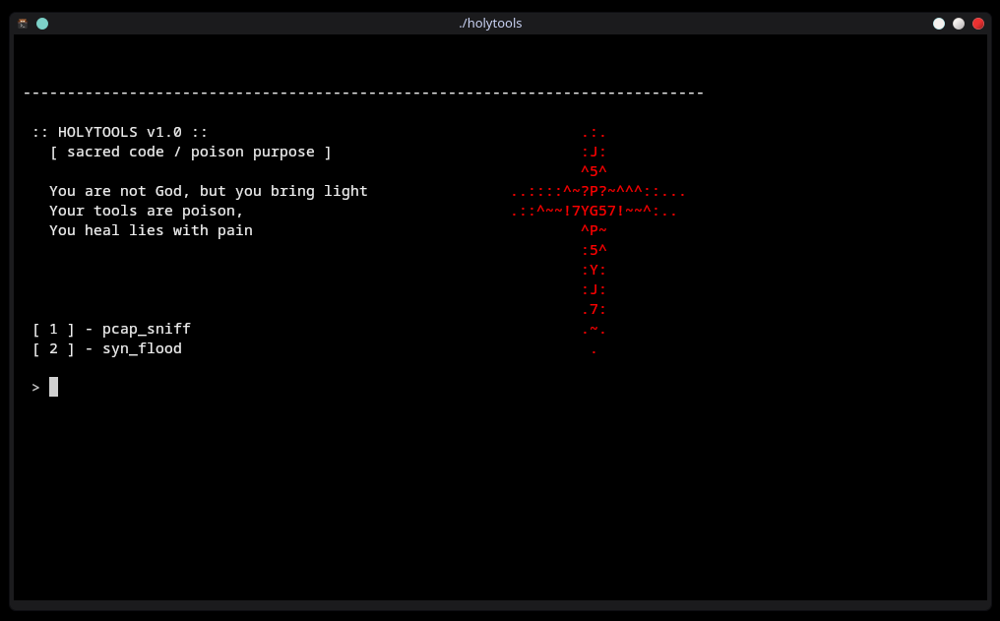
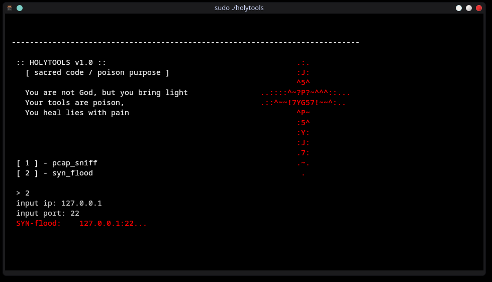
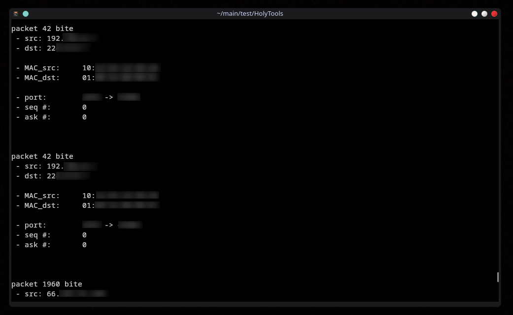

<div align="center">

# 🩸Holy Tools v1.0🩸
*Research / Educational toolkit for network experiments*

</div>

> **Important!** This repository is provided strictly for educational purposes — to study networking protocols and security. **It is expressly forbidden** to use the contents of this project for malicious purposes or against networks/systems for which you do not have explicit permission from the owner.

---

## Project Purpose

**Holy Tools** is a demonstrational set of tools assembled for learning and researching network behavior and defensive mechanisms. The project is intended only for:

- understanding how network protocols work;  
- creating isolated labs for testing and debugging;  
- studying detection methods and defenses against network attacks (for research/educational purposes).

By downloading this repository you confirm that you will use it only in authorized, isolated environments (virtual machines, test networks, lab environments).

---

> [!WARNING]
> **Warning:** Everything in this repository is created solely for study. Using the project’s tools against other systems without permission is illegal and unethical. The author and maintainers are not responsible for misuse.

---

## Screenshots





---

## Features (overview)

> Descriptions are high-level — no operational instructions provided.

- **pcap_sniff** — a demonstration of capturing and analyzing network traffic (used to study packet formats and structure).  
- **syn_flood** — a demonstrational implementation of a technique referenced in DoS analysis (intended only for test networks).
- **arp_spoffing** — 100% WiFi connection disruption (intended only for test networks).
- **Soon again...**

---

## Safety & Usage Recommendations

1. **Use only in isolated labs.** We recommend running these tools in virtual machines and/or on physically separate networks that are not connected to production infrastructure.  
2. **Obtain permission.** Before testing any system, ensure you have written authorization from the system owner.  
3. **Do no harm.** Do not attempt to use these tools against public services, work networks, or other people's devices.  
4. **Use for defense and research.** Use the materials to learn how to detect and mitigate threats, not to exploit them.

---

## Dependencies

> ArchLinux:

```bash
sudo pacman -S libpcap libnet
```
```bash
git clone https://github.com/Tabyretkadp/HolyTools.git
cd HolyTools
make
```

